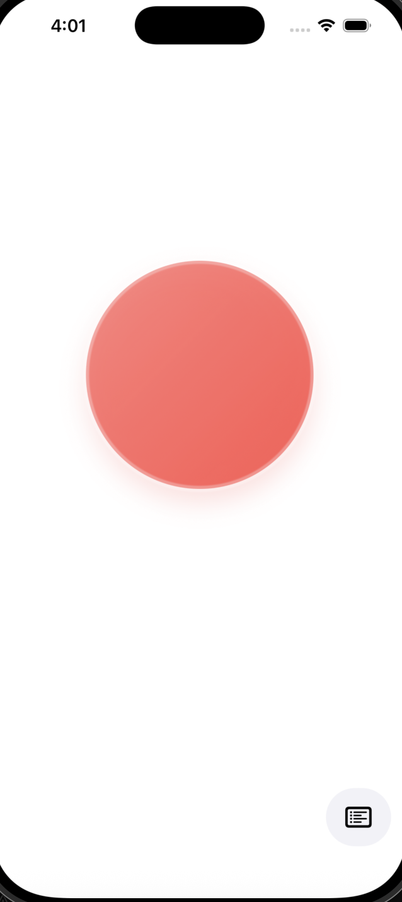
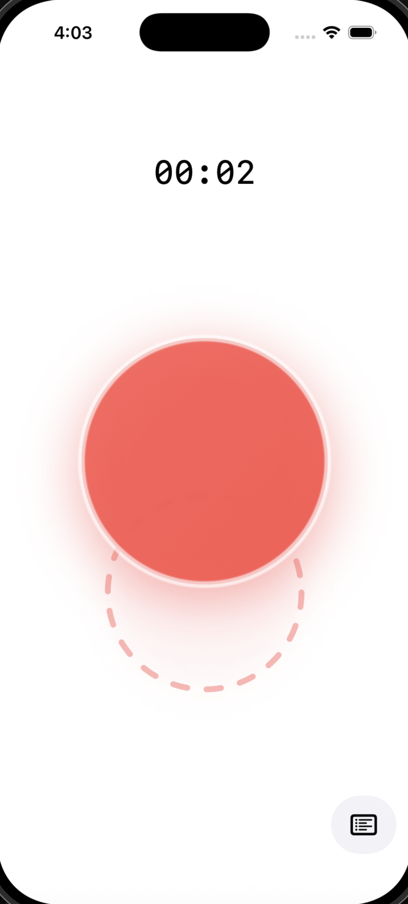
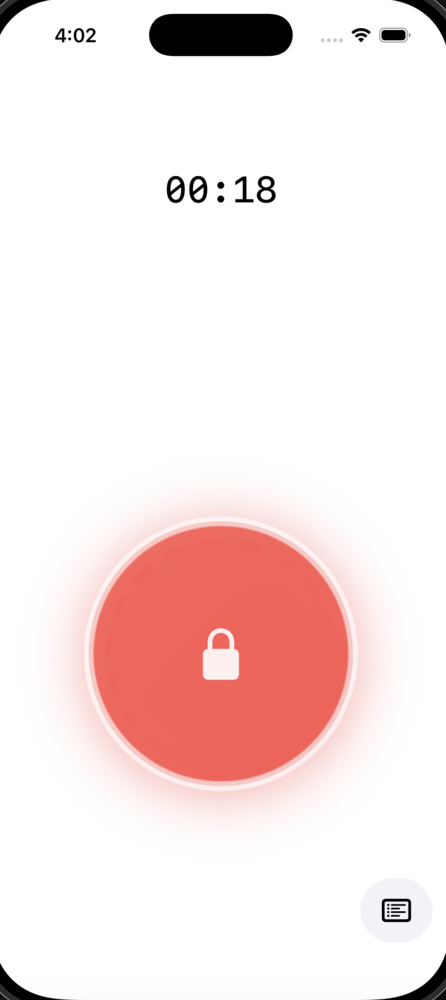
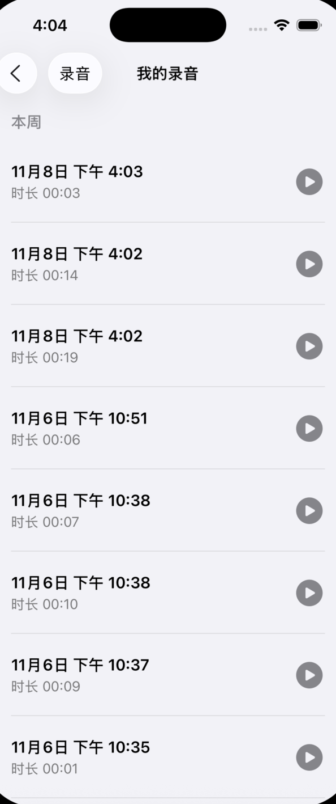
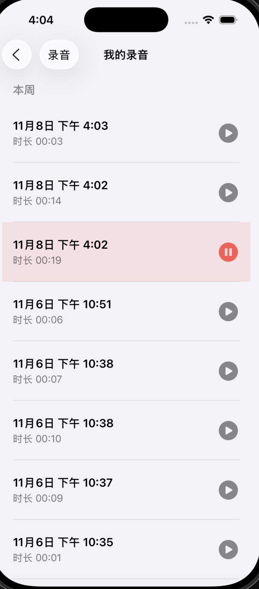

“微表达” App (MVP 1.0) 产品需求文档 (PRD)
1. 背景与目标
 * 背景 (Why): 用户（即开发者本人）在日常工作和生活中，常感“心里想法多，但表达不畅”。这源于心理包袱（如在意他人看法）和精神疲劳。当前需要一个工具来捕捉这些转瞬即逝的、未经过自我审查的“碎片化想法”。
 * 目标 (What): 开发一个**“零阻力”**的 iOS App。它必须是个人专属的“思绪安全区”，允许用户在有想法的瞬间，以最低的心理和操作成本将其记录下来。
 * 成功标准: 用户（即你）能够毫不费力地在任何时候打开 App，通过一个动作完成录音，并且能方便地在周末进行回顾。
2. 核心原则
 * 零阻力 (Zero Friction): 永远优先考虑“快速启动”和“即时录音”。App 的核心功能必须在 1-2 秒内可达。
 * 绝对私密 (Private First): 这是一个“路径一”的 App。所有数据（录音）100% 存储在本地，不上传、不同步。这为用户提供了绝对的心理安全。
 * 专注 MVP (Focus): 仅包含“录音”和“查看”两个核心功能。坚决砍掉所有（在当前阶段）会增加复杂性的功能（如AI转录、标签、编辑、云同步等）。
3. 功能详述
页面一：录音页 (Capture Screen)
这是 App 启动后立即进入的默认主页。
 * 目标: 让用户在打开 App 的一瞬间就能开始录音。

**当前界面设计：**

 * UI 元素:
   * 录音按钮 (Record Button): 屏幕中央一个醒目、巨大的圆形按钮。这是页面的绝对焦点。采用温暖的珊瑚色（coral pink），带有柔和的阴影效果，营造出亲和、放松的氛围。
   * 仓库入口 (Repository Button): 在屏幕的角落（例如：右下角），放置一个低调的图标按钮（例如"列表"或"文件夹"图标），用于导航到"仓库页"。
   * 状态显示器 (Status Label): 默认隐藏。位于录音按钮上方，用于显示录音时长和保存状态。
 * 交互流程 (User Flow):
   * 默认状态:
     * 用户打开 App，看到一个巨大的“录音按钮”。
     * 状态显示器隐藏。
   * 用户“按住” (Touch Down):
     * Event: 用户的手指 按住 “录音按钮”。
     * Action: 立即开始录音。
     * Feedback 1 (Haptic): 手机轻微震动一下（Taptic Engine），确认录音已开始。
     * Feedback 2 (Visual): “录音按钮”本身发生变化（例如：轻微放大、颜色变深），表明它正处于“激活”状态。
     * Feedback 3 (Timer): “状态显示器”出现，开始显示录音时长，格式为 00:01, 00:02, 00:03...
   * 用户“松开” (Touch Up) - 快速录音:
     * Event: 用户在未进行长距离拖拽的情况下，直接松开手指。
     * Action 1: 立即停止录音。
     * Action 2: 将该录音文件（包含录音数据、当前日期时间、总时长）保存到本地数据库。
     * Feedback 1 (Transient): “状态显示器”的文本从计时器变为“已保存”。
     * Feedback 2 (Haptic): 手机再次轻微震动，确认保存成功。
     * Feedback 3 (Reset): 1.5 秒后，“已保存”文字自动淡出消失，“录音按钮”恢复到默认的“未激活”状态。
   * 用户"按住并向下拖拽" (Drag Down) - 锁定录音:
     * Event: 用户按住按钮后，手指向下滑动超过一定距离。
     * Feedback 1 (Visual): 按钮下方出现一个虚线圆形的"锁定区域"作为视觉引导。录音按钮会跟随手指标识位置。

     * Event: 用户将手指拖入"锁定区域"后松开。
     * Action: 录音被锁定，进入"免持录音"模式。
     * Feedback 2 (Visual): 录音按钮移动并停留在"锁定区域"，按钮上出现"锁"图标。
     * Feedback 3 (State): 录音持续进行，计时器继续走动，用户此时可以完全松开手指。

   * 用户“单击已锁定的按钮” (Tap on Locked Button) - 停止录音:
     * Event: 在“免持录音”模式下，用户单击位于锁定区的录音按钮。
     * Action: 行为与“松开”一致，立即停止并保存录音。
     * Feedback: 触发与“松开”一致的“已保存”状态提示、震动反馈和最终的界面重置。
   * 最终结果: 无论通过哪种方式结束，页面最终都会回到最初的“默认状态”，等待下一次记录。
页面二：仓库页 (Repository Screen)
这是用户回顾自己所有"微表达"的地方。
 * 目标: 清晰、有序地展示所有录音，便于用户回顾和"淘金"（寻找模式）。

**当前界面设计：**

 * UI 元素:
   * 导航栏 (Navigation Bar):
     * 标题: "我的录音" (My Recordings)。
     * 返回按钮: 左上角一个"返回"按钮（或直接用"< 录音"字样），点击后返回"录音页"。
   * 录音列表 (Recording List): 占据页面的主要区域，是一个可滚动的列表。采用浅灰色背景，保持与录音页一致的极简风格。
 * 列表功能要求:
   * 排序 (Sorting): 列表必须 严格按照录音时间倒序排列（最新的录音在最顶部）。
   * 分组 (Grouping): 为了实现你“以周为单位”的需求，列表需要被分成不同的 Section。
     * Logic: App 需要根据录音的日期，将其归入不同的周。
     * UI: 每个 Section 都有一个清晰的标题（例如：“本周”、“上周”、“10月第3周”等）。这完全符合你说的“在UI上稍作区分”。
   * 列表项 (List Item / Cell): 列表中的每一行代表一个录音，必须清晰地显示：
     * 日期和时间:（例如：“11月1日 下午 2:15”）
     * 录音时长:（例如：“00:35”）
   * 播放功能 (Playback - Implied): 这是本页面的一个隐含的核心功能。
     * Event: 用户 点击 列表中的任意一行（任意一个录音）。
     * Action: App 立即播放 该录音文件。
     * Feedback (Optional but Recommended): 被点击的行可以高亮，并显示一个"播放中"的指示器，再次点击则暂停。

**播放状态界面：**

*说明：播放中的录音会以粉色背景高亮显示，播放按钮变为红色的暂停按钮，提供清晰的视觉反馈。*

**新增功能：结构化表达编辑**

在仓库页中，每条录音旁边新增了一个"文本编辑"按钮（笔图标），点击后可以：
 * 进入文本编辑页面，记录针对该录音的深度思考
 * 支持标题和正文编辑，帮助用户将碎片化的录音想法整理成结构化的文字
 * 左滑退出编辑，内容自动保存

仓库页底部新增 Tab 切换栏：
 * **录音** Tab：展示所有录音列表（原有功能）
 * **文本编辑** Tab：展示所有结构化表达内容，以标题形式呈现
   * 点击任意文本笔记可查看和继续编辑
   * 支持滑动删除

**设计理念：** 从"快速捕捉碎片化想法"到"深度结构化思考"的自然延伸，帮助用户在周末回顾时将零散的录音进一步推进思考，挖掘情绪的深层原因，或形成更完整的解决方案。

4. 数据模型 (Data Model)
为了实现上述功能，你需要在本地数据库中（建议使用 SwiftData 或 Core Data）创建以下数据模型：

**Recording (录音对象)**
 * id: UUID (唯一标识符)
 * timestamp: Date (录音的精确日期和时间，用于排序和分组)
 * duration: TimeInterval (录音时长，例如 35.2 秒，用于显示)
 * fileName: String (指向设备上保存的音频文件名)

**TextNote (结构化文本笔记对象)** - 新增
 * id: UUID (唯一标识符)
 * title: String (笔记标题)
 * content: String (笔记正文内容)
 * createdAt: Date (创建时间)
 * updatedAt: Date (最后更新时间)
 * recordingID: UUID? (关联的录音ID，可选)
5. MVP 范围之外 (Out of Scope for V1)
以下功能不在我们这个 MVP 的范围内，这能帮助你保持专注：
 * 不做 AI 语音转文字。
 * 不做录音编辑、裁剪或重命名。
 * 不做任何形式的标签或分类。
 * 不做 iCloud 同步或任何云端备份。
 * 不做搜索功能。
这份 PRD 足够你启动 Xcode 项目了。它在技术上是完全可行的，并且完美地平衡了“功能”与“零阻力”的目标。
